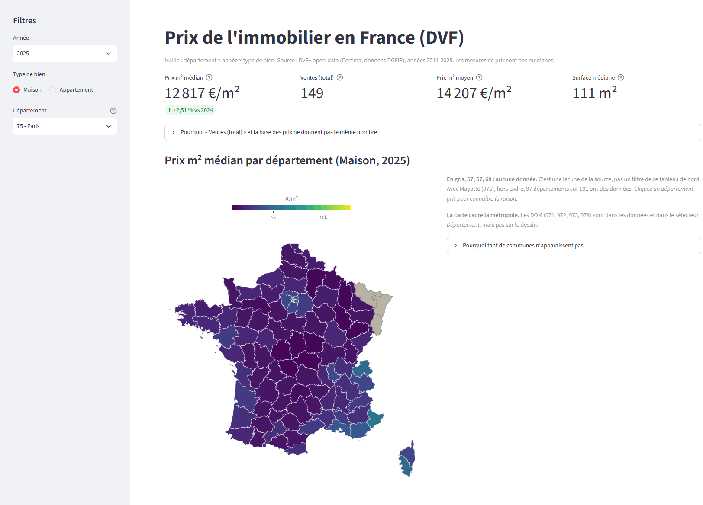

# Prix de l'immobilier en France - pipeline DVF+

Pipeline analytique sur les **DVF+ open-data** (demandes de valeurs foncières agrégées à la mutation, produites par le Cerema à partir des données DGFiP) et tableau de bord de lecture : 16 565 022 mutations, actes de 2014 à 2025, agrégées en prix au m² médians par département et par commune.

Le projet est autant une démonstration de **modélisation honnête** que de tuyauterie : chaque décision qui déplace un chiffre est écrite, mesurée et testée, et les limites du jeu de données sont déclarées dans l'application.

**[Ouvrir le tableau de bord](https://dvf-analytics-gg.streamlit.app/)**



## Architecture

```
CSV DVF+ (Cerema)  ──►  dbt Fusion  ──►  marts  ──►  export  ──►  Streamlit
+ COG Insee            (data/dvf.duckdb)                        (app/app.duckdb)
(data/raw_*, non versionnés)
```

Trois couches, huit modèles, matérialisation `table` partout (édition figée : pas d'incrémental, un `dbt build` complet reconstruit tout).

| Couche | Modèle | Lignes | Rôle |
| --- | --- | ---: | --- |
| staging | `stg_dvfplus__mutations` | 16 565 022 | lecture des 97 CSV départementaux (séparateur `\|`), typage. **Une ligne = une mutation**, la maille est celle de la source |
| staging | `stg_cog__communes` | 37 496 | le Code officiel géographique 2026 de l'Insee - DVF+ ne livre aucun nom de commune |
| intermediate | `int_dvfplus__mutations` | 16 527 605 | vocabulaire canonique, `prix_m2`, flags de population |
| intermediate | `int_dvfplus__mutations_rejected` | 37 417 | mutations à `valeur_fonciere` absente ou non positive, mises de côté et non détruites |
| marts | `fct_mutations` | 15 187 998 | les seules ventes (`nature_mutation = 'Vente'`), maille mutation |
| marts | `dim_commune` | 36 912 | code commune → nom, département, depuis le COG |
| marts | `mart_prix_departement` | 2 328 | `département × année × type de bien` - grille saturée : 97 × 12 × 2 |
| marts | `mart_prix_commune` | 449 027 | `commune × année × type de bien`, avec variation annuelle |

Le compte des mutations se referme exactement : **16 565 022** mutations livrées = **16 527 605** retenues + **37 417** rejetées (partition prouvée à chaque build par `assert_partition_rejetees`).

La source arrive déjà à la maille mutation, c'est-à-dire au niveau d'agrégation que le pipeline publie : il n'a donc **ni déduplication ni changement de maille**, et l'unicité de `idmutation` est mesurée sur toute la livraison.

## Démarrage rapide

Prérequis : Python **3.14.7** (les épinglages de `requirements.txt` n'ont été résolus que sous cette version), **dbt Fusion** - un binaire autonome, pas un paquet pip ; version utilisée ici `2.0.0-preview.212` - et **py7zr** (`pip install py7zr`, hors `requirements.txt` qui ne décrit que l'application déployée). Prévoir **25 Go de disque libres** : 1,1 Go d'archive, 8,9 Go de CSV extraits, et la base de données de travail `data/dvf.duckdb` autour de **11 Go**, sa taille variant d'un build à l'autre.

```bash
pip install -r requirements.txt py7zr
python scripts/download_dvfplus.py   # ~1,1 Go + extraction ; télécharge aussi le COG Insee
cd dbt && dbt build && cd ..         # ~7 min, 46 nœuds : 8 modèles + 38 tests
python scripts/export_app_db.py      # marts -> app/app.duckdb, le seul fichier que lit l'app
streamlit run app/streamlit_app.py
```

**Pour seulement regarder le tableau de bord, deux commandes suffisent** : `pip install -r requirements.txt` puis `streamlit run app/streamlit_app.py`. L'application n'ouvre jamais la base de travail `data/dvf.duckdb` - elle ne lit que `app/app.duckdb`, qui est versionné et arrive donc avec le clone. **Les trois commandes du milieu reconstruisent les données depuis la source** : elles refont le pipeline entier, et c'est le seul moyen de contrôler le référentiel de reproductibilité. Rien d'autre dans le dépôt n'installe les dépendances : si l'on saute `pip install`, l'échec n'arrive qu'au téléchargement (py7zr) ou à l'export, après un `dbt build` complet - c'est-à-dire là où il coûte le plus cher.

**Sous Windows** : les commandes `dbt` se lancent depuis le dossier `dbt/` ; ailleurs, Fusion répond que le répertoire courant n'est pas un projet dbt.

## Décisions de modélisation

**La maille est la mutation.** Une mutation est un acte : elle peut porter plusieurs biens et une seule `valeur_fonciere`. Descendre au local obligerait à répartir un prix unique entre plusieurs biens selon une règle inventée ; la maille mutation ne répartit rien. DVF+ livre cette maille directement, une ligne = un acte, identifiant unique vérifié sur les 16 565 022 lignes.

**Le périmètre mono-logement vient de la typologie officielle.** La colonne `codtypbien` du Cerema classe le bien de chaque mutation ; le pipeline ne donne un `type_local` qu'aux classes mono-logement : `111` (une maison) et `121` (un appartement). Une maison vendue avec sa dépendance reste « UNE MAISON », et sa surface (`sbati`) est celle du logement seul : vérifié année par année, `sbati` = surface du type sur 5,6 millions de maisons, 15 exceptions toutes en 2014-2016.

**Une discontinuité de la source, déclarée parce qu'elle se voit.** La part des maisons vendues avec une dépendance enregistrée passe de ~5 % (2014-2019) à 9 % (2020) puis 30-37 % (2021-2025) : c'est un changement d'**enregistrement** chez l'éditeur. Les mesures restent valides, la surface étant celle du logement dans les deux ères et la médiane nationale Maison ne montrant aucune rupture au passage (1 739 €/m² en 2014, 1 897 en 2020, 2 030 en 2021, 2 164 en 2025) ; seul le sens de `n_locaux` change selon l'année.

**Trois populations imbriquées, jamais confondues.** Sur les ventes Maison et Appartement de la livraison :

- **volume** - toutes les ventes valides du périmètre mono-logement, c'est `n_ventes_total` : 9 817 126 ;
- **éligibles** - les mêmes 9 817 126 aujourd'hui : la typologie officielle garantit une surface positive sur tout le périmètre. La coïncidence vient des données et non du code : le garde `sbati > 0` reste en place, et le test d'identité des populations la surveille ;
- **plausibles** - 9 779 743 : celles dont le prix au m² tombe dans [100 ; 40 000] €/m² et la surface dans [9 ; 1 500] m². C'est la seule base des médianes.

Aucune ligne n'est supprimée à ce stade : les ventes écartées portent un flag. Et `prix_m2` n'est calculé **qu'une fois**, dans l'intermediate, jamais dans un mart ni dans l'application, pour qu'il n'existe qu'une seule définition du rapport.

**`nature_mutation = 'Vente'`, égalité stricte.** Un `like 'Vente%'` ferait entrer 1 168 083 mutations de plus : ventes en l'état futur d'achèvement (1 099 309) et terrains à bâtir (68 774). Aucune valeur ne sortirait des plages, aucun test ne se déclencherait : l'erreur serait invisible parce que plausible. L'exclusion de la VEFA est en plus **prouvée** par une colonne indépendante : la source porte un flag `vefa`, transporté jusqu'à `fct_mutations`, où `assert_vefa_exclue` vérifie qu'il est faux partout.

**La commune n'est définie que quand elle est unique.** Un acte peut toucher plusieurs communes : DVF+ livre la liste. Plutôt que d'attribuer arbitrairement l'acte à la première, `code_commune` reste absent quand `nbcomm > 1` (1,19 % des ventes, 180 390 actes) : ces actes comptent dans les chiffres départementaux et sont absents de `mart_prix_commune`, et l'écart entre les deux totaux est exactement leur compte, ce que `assert_reconciliation_marts` vérifie à chaque build.

**Le seuil de 30 ventes s'applique aux deux années.** Le classement par variation annuelle exige 30 ventes plausibles l'année courante **et** l'année précédente : 48 161 cellules (combinaisons commune × année × type de bien) passent, contre 55 180 si l'on ne regardait que l'année courante. Les 7 019 écartées avaient une base sous le seuil l'année d'avant, avec un minimum observé d'**une seule vente**, et une variation calculée contre la médiane d'une seule vente ne mesure rien.

**Les mutations rejetées sont conservées avec leur motif.** Les 37 417 mutations à valeur foncière inexploitable vivent dans `int_dvfplus__mutations_rejected`, avec le motif du rejet : 32 129 `valeur_fonciere_nulle` et 5 288 `valeur_fonciere_non_positive`. Cette seconde branche **était à zéro** tant que le projet n'analysait que 2021-2025 : elle avait été écrite d'avance plutôt que déduite des données du jour, et l'ouverture aux années 2014-2020 l'a peuplée sans qu'une ligne de code change. Elles n'entrent ni dans `fct_mutations` ni, par conséquent, dans `n_ventes_total`.

## Limites déclarées

Le jeu de données a des trous et le pipeline a un coût. Les deux sont écrits ici et rappelés dans l'application.

**Couverture de la source.** 97 départements sur 101. Manquent la Moselle (57), le Bas-Rhin (67) et le Haut-Rhin (68), sous *droit local* avec livre foncier et non couverts par les DVF, ainsi que Mayotte (976). C'est une lacune de la source, visible en gris sur la carte.

**Édition et période.** Édition **2026.1** (ED251, avril 2026), actes du 02/01/2014 au 31/12/2025. Le projet analyse **toute la livraison**, sans fenêtre : les douze années ont été vérifiées complètes avant de l'ouvrir - 12 mois et 97 départements chacune, de 1,07 à 1,71 million de mutations, aucune année tronquée. Il n'y a aucun filtre d'année dans le pipeline, ce qui est plus fort qu'un filtre large : une année livrée en plus entrera sans qu'une constante bouge. Le Cerema publie deux éditions par an : qui relance le projet plus tard doit s'attendre à une édition plus récente.

Les six limites numérotées :

1. **Le périmètre de prix est mono-logement.** Les mutations multi-logements (`112` « des maisons », `122` « deux appartements »...) et indéterminées (`110`, `120`) n'entrent ni dans le volume ni dans les prix des marts : leur `valeur_fonciere` couvre plusieurs biens et le prix au m² de chacun n'est pas attribuable. Les DVF+ enregistrent correctement une mutation vendant trois appartements pour 900 000 € ; c'est la maille mutation qui ne peut pas en dire le prix du m².
2. **Les dépendances sont dans le périmètre, pas dans la surface.** Une maison vendue avec son garage reste « une maison » (typologie officielle) et son prix couvre le tout, mais la surface au dénominateur est celle du logement seul : le prix au m² des mutations avec dépendance est légèrement surestimé par construction. L'alternative - les exclure - amputerait 18,6 % des maisons sur l'ensemble, mais 37 % sur les années récentes et 5 % sur les anciennes, à cause du changement d'enregistrement décrit plus haut : le filtre lui-même serait biaisé dans le temps.
3. **Les actes multi-communes (180 390, 1,19 %) n'ont pas de commune.** Ils comptent au département et sont absents de `mart_prix_commune`, 39 553 d'entre eux dans le périmètre Maison/Appartement.
4. **La population des prix est plus étroite que le volume.** 37 383 ventes éligibles (0,38 %) sont écartées des médianes parce que leur prix n'est pas une observation de marché : 36 052 sous 100 €/m² (prix symboliques, nue-propriété, cessions intrafamiliales), 1 320 au-dessus de 40 000 €/m² et 26 surfaces hors plage, dont 15 cumulent un critère de prix et un critère de surface. Le cas d'école est mesurable : `58131 / Appartement / 2021` compte 29 ventes et **aucun prix utilisable** ; dans certaines cellules le prix symbolique est la norme, et la colonne `n_ventes_prix_exclues` existe pour le signaler.
5. **347 codes commune (18 629 ventes, 0,124 %) manquent au COG 2026**, pour deux raisons distinctes : 12 224 actes portent le code d'une commune **fusionnée** depuis, et la part décroît régulièrement avec l'âge de l'acte (0,365 % en 2014, 0,033 % en 2025) ; 6 405 portent Saint-Barthélemy ou Saint-Martin, **collectivités d'outre-mer** sorties du système départemental en 2007, que DVF continue de livrer avec la Guadeloupe. Leurs ventes comptent partout, mais sans nom lisible ; `assert_communes_orphelines` borne cette part à 0,30 % - un seuil posé entre l'état mesuré et la première régression réaliste (perdre les communes déléguées donnerait ~0,55 %).
6. **871 cellules commune (0,19 %) ont du volume et aucun prix observable**, pour 963 ventes réelles.

7. **Le seuil de volume ne dit pas tout de l'incertitude d'une variation.** Une cellule peut dépasser largement les 30 ventes et porter quand même une variation fragile. Mesuré par bootstrap (1 000 rééchantillonnages) sur les 194 couples département × type de bien (97 × 2) de la comparaison 2014-2025, l'intervalle à 95 % fait **7,6 points** de large en médiane, mais **14 couples dépassent 20 points**. Paris donne l'exemple le plus net : les **appartements** font +20,4 % avec un intervalle de [+19,8 ; +21,0], 1,2 point de large, sur près de 25 000 ventes ; les **maisons** +24,1 % avec [+4,5 ; +41,8], 37 points de large, sur 114 ventes. Seul le chiffre des appartements est fiable, et c'est `n_ventes_eligible` qui le dit. L'élargissement à douze années a resserré la plupart des intervalles (la médiane était de 6,3 points sur la seule fenêtre 2021-2025, sur des bases deux fois plus minces) et rend comparables des écarts de onze ans.

À la maille commune, trois limites de plus :

- **86,95 % des cellules** sont sous le seuil de 30 ventes, et le classement montre les 13,05 % restants : c'est ce qu'implique la maille commune sur douze ans de DVF ;
- le filtre de plausibilité **expulse 211 cellules** du classement : au-dessus du seuil en comptant toutes les éligibles, en dessous en ne comptant que les plausibles ;
- **Paris, Lyon et Marseille n'existent pas comme communes dans les DVF** : la source les porte en **45 arrondissements**, traités tels quels, sans agrégation. Agréger permettrait d'additionner les comptages mais pas les médianes (le rapprochement croisé des deux marts le mesure : 2 325 cellules sur 2 328 diffèrent, jusqu'à 1 962 €/m²). En contrepartie, sur 991 cellules d'arrondissement, **272 (27,4 %) sont sous le seuil**, toutes `Maison`, et aucune des 540 cellules `Appartement`. Le prix des maisons à Paris reste donc une mesure fragile dans ce jeu de données.

## Reproductibilité

**Couple de versions DuckDB validé.** La base de travail est écrite par le DuckDB embarqué dans dbt Fusion - `v1.5.4`, `source_id 08e34c447b` - et relue par le paquet pip `duckdb 1.5.5` (`source_id d8cdaa33fd`), qui produit `app/app.duckdb` et alimente l'application. `requirements.txt` n'épingle que le lecteur : la version de l'écrivain est déclarée ici, parce que c'est ce couple-là qui a été vérifié.

**Un fichier DuckDB n'est pas reproductible à l'octet, à données identiques.** Deux constructions successives d'une même table donnent la même taille et le même contenu avec **47,63 % d'octets différents** (mesuré, même à un seul fil d'exécution). `app/app.duckdb` **changera donc à chaque régénération, même si les données sont inchangées** ; c'est une propriété du format, et la vérification en tient compte.

**La vérification se fait donc par contenu, jamais par octets.** `scripts/reference_fingerprint.json`, versionné, contient pour chacune des huit tables un compte et deux sommes de contrôle indépendantes de l'ordre, un échantillon fixe de cellules, les empreintes SHA-256 des deux entrées brutes - l'archive nationale DVF+ telle que publiée et le fichier COG - et les *tree hashes* de `dbt/`. `python scripts/reference_fingerprint.py` le régénère ; un clone se compare au référentiel dans cet ordre : lecteur, code, entrées brutes, tables, échantillon de cellules. Un `dbt_tree` différent rend la comparaison **non pertinente**, parce que le référentiel a été établi à partir d'un autre code ; seule une divergence des tables **à code et entrées identiques** est une régression.

## Tests

`dbt build` exécute **46 nœuds : 8 modèles et 38 tests**, génériques et singuliers. Quelques-uns méritent d'être nommés, parce qu'ils surveillent la **construction** elle-même :

- `assert_prix_m2_range` et `assert_surface_range` - aucune vente plausible hors de [100 ; 40 000] €/m² ni de [9 ; 1 500] m². Vrais par construction depuis que le flag existe : la définition et la sentinelle sont écrites en deux points du code, et une divergence entre les deux devrait frapper deux fois pour passer inaperçue ;
- `assert_reconciliation_marts` et `assert_identite_populations` - vérifient cellule par cellule que les comptages des marts se recoupent avec la table de faits, que les populations s'emboîtent, et que l'écart entre les totaux des deux marts est exactement le compte des actes multi-communes ;
- `assert_yoy_garde` - la variation annuelle est **absente** (`NULL`, jamais zéro) partout où l'année précédente manque dans la série, la fenêtre étant reconstruite par jointure, indépendamment du modèle. Sans ce test, un lag positionnel produirait 26 228 nombres plausibles et faux sur les données actuelles ;
- `assert_vefa_exclue` - l'exclusion du neuf est prouvée par le flag `vefa` de la source, une colonne **indépendante** de celle que le filtre utilise ;
- `assert_partition_rejetees` - valides + rejetées = la fenêtre entière, sans recouvrement ni trou, et la part rejetée reste sous 2 % (mesurée : 0,226 %).

## Structure du dépôt

```
app/            streamlit_app.py, departements.geojson, app.duckdb - l'export
                léger produit par scripts/export_app_db.py, versionné pour que
                l'application démarre sur un clone frais
dbt/            models/{staging,intermediate,marts}, tests/, dbt_project.yml, profiles.yml
scripts/        download_dvfplus.py, export_app_db.py, reference_fingerprint.py (+ .json),
                simplify_geojson.py
data/           raw_dvfplus/ et raw_cog/ (script de téléchargement), dvf.duckdb (dbt build)
                - non versionnés
docs/           demo.gif - l'aperçu animé du README
```

## Sources des données

**DVF+ open-data**, produit par le **Cerema** à partir des Demandes de valeurs foncières de la **DGFiP**, diffusé sous Licence Ouverte 2.0 via [data.gouv.fr](https://www.data.gouv.fr/datasets/dvf-open-data) et [datafoncier.cerema.fr](https://datafoncier.cerema.fr/) ; dictionnaire des variables sur [doc-datafoncier.cerema.fr](https://doc-datafoncier.cerema.fr/). Édition utilisée : **2026.1** (ED251).

**Code officiel géographique 2026**, publié par l'[Insee](https://www.insee.fr/fr/information/8740222), pour les noms de communes.

Les fichiers ne sont pas redistribués dans ce dépôt : `scripts/download_dvfplus.py` les récupère depuis les sources.
